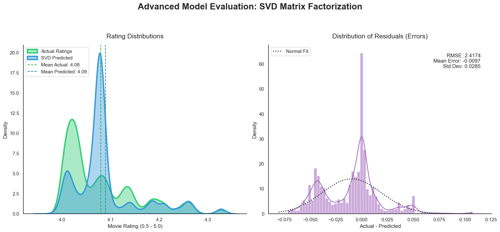

# Headline:
# **Beyond Blockbuster: Recommendation Algorithm Unlocks New Cinema Experience!**

## Hook:
STOP SCROLLING, START WATCHING: In the age of infinite streaming, we spend more time scrolling through "Trending" lists than actually enjoying movies. Most algorithms are built to show you what everyone else is watching, causing high-quality, niche films, the "Hidden Gems", to disappear under a mountain of blockbusters. We are building a discovery engine that ignores the noise and finds the movies that actually match your unique taste, even if they aren't "trending" or "leading" films.

## Problem Statement:
Today’s media landscape suffers from a "Paradox of Choice": the more options we have, the harder it is to choose. Current recommendation systems often fall into the trap of "Popularity Bias," where the same few high-budget films are pushed to every user. This creates an echo chamber where small-budget masterpieces or international hits are buried simply because they haven't reached a massive audience yet. For the average viewer, this leads to decision fatigue and a sense that "there’s nothing good to watch," despite thousands of available titles.

## Solution Description:
Our solution is a next-generation recommendation engine that combines the power of massive data analysis with personalized mathematical modeling. By analyzing over 32 million movie interactions, our system identifies patterns in what viewers truly value beyond just the "hype." Instead of just looking at what is popular, the engine builds a digital profile of your specific cinematic preferences, like your favorite pacing, themes, and genres. It then cross-references your profile against thousands of "Hidden Gems" to surface high-quality movies you’ve likely never heard of but are guaranteed to love. It’s not just a list of movies, but a personalized map to the best of modern cinema, designed to end the "infinite scroll" forever.

## Chart:
 

