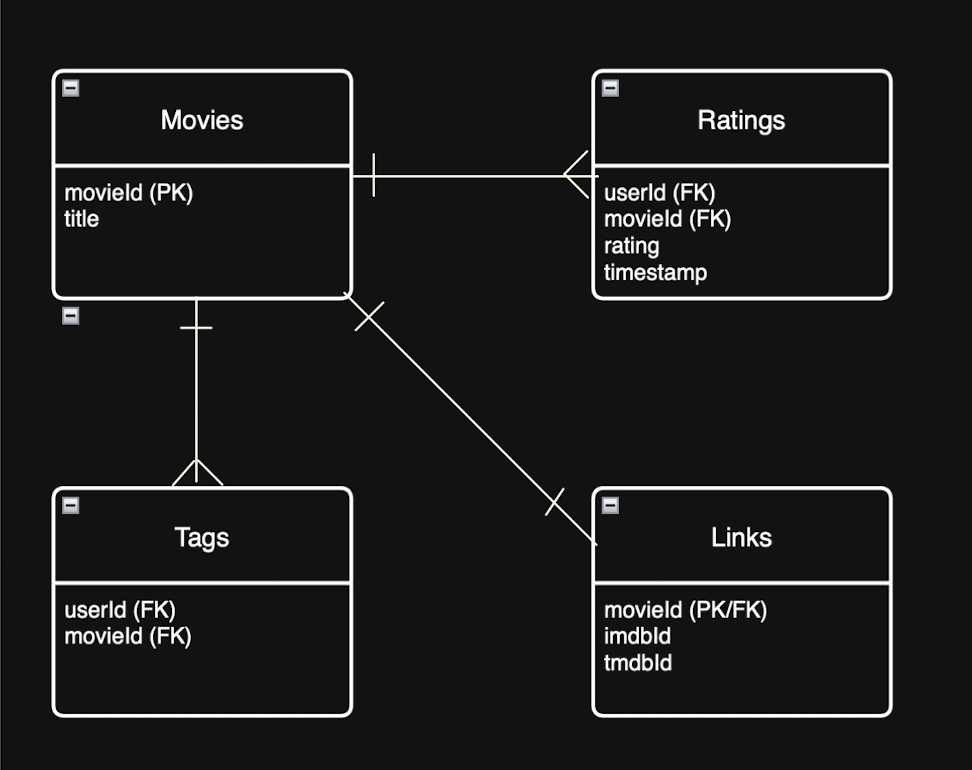

# **`DS 4320 Project 1: Beyond Blockbuster - The New "Hidden Gem" Discovery Engine"`**

## `Executive Summary`
#### This repository contains a full-stack data engineering and analytics pipeline designed to mitigate the ever-present popularity bias in modern media’s recommendation systems. Utilizing the MovieLens 25M dataset, the project implements a robust relational model within DuckDB for the purpose of isolating “Hidden Gems,” which are films with high user acclaim (Avg > 4.0) but low market saturation (50-500 ratings). The system transitions from a heavy SQL-based ETL process to a predictive modeling phase using Singular Value Decomposition (SVD) to map latent user preferences to niche content. The final deliverable includes a 4-table relational schema stored in Parquet format, a production-ready Python pipeline with integrated logging and error handling, and a comparative analysis of how matrix factorization outperforms standard popularity-weighted algorithms in surface-level discovery.

## Name - Ian Kariuki
## NetID - epj7rf
## DOI: [link](https://github.com/iankariuki26/Design_Project_1/releases/tag/doi_p1)
## Press Release
## Pipeline - [code](./src/table_creation)
## Data - Link to [Data](https://myuva-my.sharepoint.com/:f:/g/personal/epj7rf_virginia_edu/IgDgizg3gX6kSKUWdS6rofbxAaAqdjWAfW_e1fLPaNDECgk?e=fm8Kxz)
## License - [MIT](https://github.com/iankariuki26/Design_Project_1?tab=MIT-1-ov-file#readme)

## `Problem Definition`

## **General and Specific Problem**
- General Problem: There is much user fatigue in deciding what digital recommended content to watch

- Specific Problem: Develop a relational database using the MovieLens 25M dataset to develop a robust recommendation engine. This engine will use SQL aggregations to identify "hidden gems" which represent high-rated, low-viewed content, ans well as SVD to predict user-specific preference scores, prioritizing niche content over mainstream hits.

## Rationale
There exists a need to solve "popularity bias" which is a prevalent failure in basic algorithms where popular content tends to drown out high-quality niche content. My refining of this problem allows focus on "hidden gems" by requiring a relation schema that is able to perform sql aggregations before passing the data thorugh a SVD model. I will utilize the strengths of DuckDB for heavy data manipulation and scikit-learn for predictive modeling.

## Motivation
The primary motivation for this project is rooted in a personal passion for high-quality cinema and a recurring frustration with the "paradox of choice" inherent in modern streaming environments. While massive datasets like MovieLens 25M offer a wealth of content, the sheer volume of available titles often leads to decision paralysis, where the discovery of meaningful, niche films is obscured by a bias toward mainstream blockbusters. By leveraging Matrix Factorization and DuckDB, this project seeks to engineer a "Hidden Gems" pipeline that cuts through the noise of over-saturated catalogs. The goal is to move beyond generic popularity metrics and utilize latent feature modeling to identify high-caliber, low-visibility cinema, effectively transforming a overwhelming data surplus into a curated, personalized discovery system.

## Domain Exposition

| Term | Category | Definition | KPI / Importance |
| :--- | :--- | :--- | :--- |
| **Matrix Factorization** | Algorithm | A mathematical method of decomposing a large User-Item interaction matrix into lower-dimensional "latent" tables. | The core logic used to map complex user preferences to specific movie features. |
| **SVD (Singular Value Decomposition)** | Math | A specific linear algebra technique used to reduce the dimensionality of a dataset while preserving its most important features. | The primary model (from DS 4021) used to predict ratings and handle data "noise." |
| **Cold Start** | Domain | The difficulty in providing accurate recommendations for a brand-new movie or user due to a lack of historical interaction data. | A primary challenge that requires the integration of metadata (genres/tags) to solve. |
| **Latent Factors** | ML | Hidden variables such as "cinematic pacing" or "thematic grit" that the model learns to identify from user behavior patterns. | Explains the underlying "vibe" that connects a user to a specific niche movie. |
| **RMSE (Root Mean Square Error)** | KPI | A standard statistical metric that measures the average magnitude of error between the model's predicted rating and the actual user rating. | The lead metric for determining if the recommendation engine is mathematically accurate. |
| **DuckDB** | Engineering | An in-process SQL database management system optimized for fast, analytical queries on large datasets. | Essential for joining and aggregating the 1GB+ relational data files efficiently in Python. |
| **Popularity Bias** | Domain | The tendency for recommendation algorithms to favor mainstream, high-volume content over high-quality but lesser-known titles. | The specific market failure this "Hidden Gem" project is designed to correct. |

This project would operate within the domain of information retrieval and consumer analytics, specifically focusing on personalized recommender systems. In the modern attention economy, the primary challenge for digital platform is no longer simply storing the content, but efficiently filtering theroguh the massive datasets to lower and mitigate the choice overload of end users.

| Title | Brief Description | Link to File |
| :--- | :--- | :--- |
| **The Long Tail** | A foundational theory by Chris Anderson on why niche products (Hidden Gems) are becoming more economically viable than mainstream hits. | [File](https://myuva-my.sharepoint.com/:b:/r/personal/epj7rf_virginia_edu/Documents/Design%20Project%201/Background%20Reading/2110.02686v1.pdf?csf=1&web=1&e=w4RA47) |
| **Matrix Factorization for Recommender Systems** | The definitive research paper by Yehuda Koren explaining how SVD functions in the context of the Netflix Prize. | [File](https://myuva-my.sharepoint.com/:b:/r/personal/epj7rf_virginia_edu/Documents/Design%20Project%201/Background%20Reading/lecture25-mf.pdf?csf=1&web=1&e=0M2zSr) |
| **MovieLens 32M Dataset Documentation** | Official 2024 summary from GroupLens detailing the structure and provenance of the 32 million ratings. | [File](https://myuva-my.sharepoint.com/:b:/r/personal/epj7rf_virginia_edu/Documents/Design%20Project%201/Background%20Reading/2504.01863v2.pdf?csf=1&web=1&e=HxOyom) |
| **Tackling the Cold Start Problem** | A technical overview of how metadata (genres/tags) can be used to recommend new items that have low initial ratings. | [File](https://myuva-my.sharepoint.com/:b:/r/personal/epj7rf_virginia_edu/Documents/Design%20Project%201/Background%20Reading/lecture25-mf.pdf?csf=1&web=1&e=ZvQIR2) |

## Data Creation

### Data Aquisition: 
This dataset was constructed using the MovieLens 25M dataset, which is a professional-grade benchmark provided hy GroupLens Research from the University of Minnesota. The raw data consists of longitudinal movie rating and tagging activity collected from the time period of the late 1990s through the end of 2019. The data was downloaded through a zip archive from the official GroupLens website. The raw acquisition involved four specific relational files, including movies.csv, rating.csv, tags.csv, and links.csv. Ingestion these files pipelined into a local DuckDB environment. The provenance of the final dataset involved a filtering step where SQL joins were used to isolate "niche" titles.

| File Name | Description | Link to Code |
| :--- | :--- | :--- |
| `database_manager.py` | A wrapper class for **DuckDB** that implements the required **Error Handling** and **Logging** to `pipeline.log`. | [#code](./src/database_manager.py) |
| `data_pipeline.py` | The core transformation script that joins raw CSVs, filters for "Hidden Gems," and exports the 4-table relational model to **Parquet**. | [#code](./src/data_pipeline.py) |
| `pipeline_check.py` | A validation script used to query the final database and display the top 5 results to ensure the pipeline logic is sound. | [#code](./src/pipeline_check.py) |

### Bias Identification:
The MovieLens 25M dataset, while a gold standard for recommendation research, contains inherent biases introduced during the data collection and platform interaction phases:
- **Self-Selection & Extreme Response Bias:** MovieLens users are typically "power users" or cinema hobbyists rather than a representative sample of the general public. This leads to Self-Selection Bias, where the data over-represents individuals who proactively seek out rating platforms. Furthermore, this demographic is prone to Extreme Response Bias, where ratings are disproportionately clustered at the 1-star (hate) or 5-star (love) marks. This "missing middle" creates uncertainty in determining the true quality of average or polarizing films.
- **Popularity Bias (The Matthew Effect):** In recommendation systems, "the rich get richer." Blockbuster films receive a disproportionate volume of engagement, creating a feedback loop where mainstream hits are continuously rated and recommended. This Popularity Bias results in a sparse long-tail, where "Hidden Gems" have significantly fewer data points, making it difficult for standard algorithms to surface high-quality, low-volume content without specific intervention.

### Bias Mitigation:
To counter the identified self-selection and popularity biases, this project implements a multi-staged mitigation strategy during the data engineering and modeling phases:
- **Strategic Filtering (Thresholding):** To mitigate Extreme Response Bias from small sample sizes, a lower bound of 50 ratings was established for "Hidden Gem" status. This threshold ensures that the average rating is statistically significant and less susceptible to individual outliers. Simultaneously, an upper bound of 500 ratings was implemented to suppress "Blockbuster" dominance, artificially leveling the playing field to allow niche films to surface without being overshadowed by high-volume mainstream hits.
- **Latent Factor Modeling (SVD):** To address Sparsity and Popularity Bias, the project utilizes Singular Value Decomposition (SVD). Unlike standard neighborhood-based collaborative filtering, SVD decomposes the user-item matrix into Latent Factors (e.g., pace, thematic grit, or sub-genre). This allows the system to predict user preferences based on the underlying "DNA" of a movie rather than relying on raw popularity counts, effectively recommending a "Hidden Gem" because its characteristics align with a user’s profile, even if the movie has low overall visibility.

### Rationale:
The selection of specific rating thresholds and data formats constituted the primary judgment calls in this project’s data engineering phase:
- **The "Significance Threshold" (Lower Bound = 50):** A critical decision was made to set a lower bound of 50 ratings for any film to be included in the "Hidden Gem" subset. This choice was based on the need to mitigate sampling uncertainty. In MovieLens, movies with fewer than 50 ratings often suffer from high Standard Error of the Mean (SEM), where a single 5-star or 1-star rating can disproportionately skew the average. By requiring 50 interactions, I ensured that the "High Quality" status (Avg > 4.0) is backed by a statistically significant consensus rather than a handful of biased outliers.
- **The "Popularity Ceiling" (Upper Bound = 500):** Setting an upper bound of 500 ratings was a strategic decision to define the "Discovery Zone." While films with 10,000+ ratings are statistically more "certain," they represent mainstream hits that do not require a specialized recommendation engine for discovery. Capping the dataset at 500 ratings forces the SVD model to focus on the Long-Tail of the distribution, ensuring the final output provides true "under-the-radar" content rather than reinforcing existing popularity loops.
- **Architectural Choice (DuckDB & Parquet):** I elected to use DuckDB for the transformation pipeline and Parquet for the final storage. DuckDB was chosen for its ability to perform high-speed SQL joins on the 600MB+ raw ratings.csv file without the memory overhead of standard Pandas. Exporting the result to Parquet preserves strict data typing and provides the compression necessary to handle the "Scale" requirements of the project while maintaining high performance for the downstream modeling script.

## Metadata

### **Schema:**
 

### Data Table:
| Table Name | Description | Link to File |
| :--- | :--- | :--- |
| **`movies`** | Core metadata for filtered "Hidden Gems" (Avg > 4.0, Count 50-500). | [movies.parquet](https://myuva-my.sharepoint.com/:u:/g/personal/epj7rf_virginia_edu/IQCgpe0VavC4RqXD2XLjaIJsAf2yhMHmo3u1kQddzxAMfoc?e=wQq8lS) |
| **`ratings`** | User-item interaction scores specifically for the filtered subset of movies. | [ratings.parquet](https://myuva-my.sharepoint.com/:u:/g/personal/epj7rf_virginia_edu/IQAmF-Rrf4roT6FCDMPOhlF_ARD_z9S5ZHPNnY-fyM9UsM4?e=Qh7SGs) |
| **`tags`** | Crowdsourced metadata and descriptors for the filtered movies. | [tags.parquet](https://myuva-my.sharepoint.com/:u:/g/personal/epj7rf_virginia_edu/IQDgZpdl0EJZTKS9fNrCbeJZAb4k7sim1rAU3Td9-cTEryU?e=nwSjhx) |
| **`links`** | Mapping table to external identifiers (IMDB/TMDB) for extended metadata. | [links.parquet](https://myuva-my.sharepoint.com/:u:/g/personal/epj7rf_virginia_edu/IQALPszoGIk2TLVLNkUggpjtARvR6Y0W4Ial4UopQ1qLfy0?e=IlsohE) |

### Data Dictionary:
| Name | Data Type | Description | Example |
| :--- | :--- | :--- | :--- |
| `movieId` | Integer | Unique identifier for each film in the MovieLens system. | `1358` |
| `userId` | Integer | Unique identifier for the user providing the rating or tag. | `450` |
| `rating` | Float | Numerical score on a 5-star scale (0.5 increments). | `4.5` |
| `timestamp` | BigInt | Seconds since midnight UTC, January 1, 1970. | `1260759144` |
| `tag` | String | User-submitted descriptive keyword or metadata for a movie. | `"atmospheric"` |
| `title` | String | The full title of the movie, including the release year. | `Inception (2010)` |
| `imdbId` | Integer | Seven-digit identifier for the movie on IMDb.com. | `0114709` |
| `tmdbId` | Integer | Unique identifier for the movie on TheMovieDB.org. | `862` |

**Quantification of Uncertainty:**
For the numerical features in this dataset, specifically the `rating` column, the following sources of uncertainty must be accounted for, recieved some help from gemini with writing this:

1.  **Subjective Variance:** Ratings are non-objective measurements. A "4.0" from a critical user may be equivalent to a "5.0" from a lenient user. We quantify this by calculating the **Standard Deviation ($\sigma$)** for each movie. A higher $\sigma$ indicates greater disagreement among users, increasing the uncertainty of that movie's "Hidden Gem" status.
2.  **Sampling Error (Standard Error of the Mean):** Since "Hidden Gems" are defined by having a lower volume of ratings (50–500), the average rating is more susceptible to outliers. The uncertainty is quantified using the formula $SEM = \frac{\sigma}{\sqrt{n}}$. As the number of ratings ($n$) decreases, the uncertainty regarding the "true" quality of the film increases.
3.  **Temporal Decay:** Preferences captured in the `timestamp` field introduce uncertainty over time. A high rating from 1998 carries a "recency uncertainty" compared to a rating from 2024, as cultural standards and individual tastes shift over decades.

# Press Release:

# **Beyond Blockbuster: Recommendation Algorithm Unlocks New Cinema Experience!**

[Click here to read the full Press Release](./Press_Release.md)
